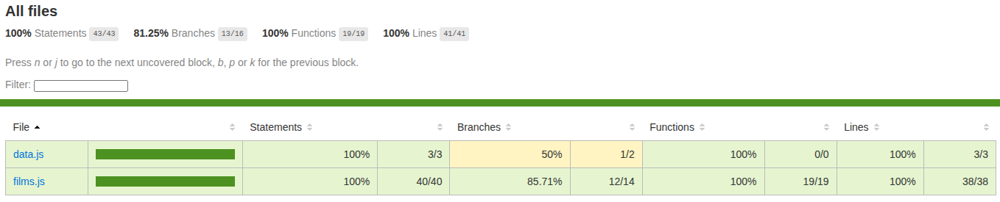

# 📚 Sprint 3 | Testing

## 🧠 Goals

- Understand and practice methods: Map, reduce, and filter.
- Create Unit Tests.
- Learn to manipulate a dataset.

## 🛠️ Getting Started

### 1️⃣ Clone this repository

```bash
git clone https://github.com/DiegoAPaez/3-Testing.git
cd 3-Testing
```

### 2️⃣ Install Dependencies

Make sure you have Node.js installed. Then install the packages:

```bash
npm install
```

### 3️⃣ Run Tests

```bash
npm run test
```

To generate a coverage report use the following command:

```bash
npm run test:coverage
```

### ✅ Coverage Report



## 📁 Folder Structure

```
📂 coverage/
📂 src/
 ┣ 📄 data.js
 ┣ 📄 films.js
📂 tests/
 ┣ 📄 films.spec.js
📄 README.md
```

## 💻 Technologies Used


## 🤝 Contributions

Contributions are welcome. Please follow the [project's guidelines](CONTRIBUTING.md) for submitting changes.

## ⏳ Project Status

 
